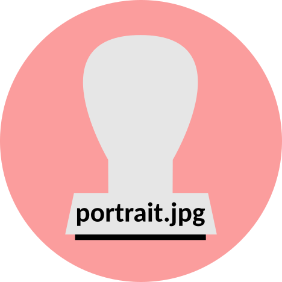

{.portrait}

## Max Nölscher

I am a part-time artist based in Berlin, Germany. I use standard wood stamps as used in offices to compose prints consisting of thousands of single stamp imprints. I usually do larger formats with something like 120 cm x 160 cm. I print on multiple materials like sketching paper, wood or textiles.

I started using stamps as some kind of drawing or printing technique in 2015/2016 when many fleeing people came to Germany and the interior minister at that time constantly spoke about deportations in press conferences or interviews. My first work was a portrait of this minister using a wooden stamp with the inscription "Abschiebung", the German word for "deportation". At that time, it was also a very personal and one of a few coping strategies to process all the emerging inhumane views on humans and nations and borders etc.

---

**Contact**\
<a id="contact-email">&#x200B;</a>

**Mastodon**\
[@ichmagsnichtmoegen@toot.community](https://toot.community/@ichmagsnichtmoegen@toot.community)

**Bluesky**\
[@ichmagsnichtmoegen.bsky.social](https://bsky.app/profile/ichmagsnichtmoegen.bsky.social)

<!-- **CV**\ -->
<!-- [Download PDF](cv.pdf) -->

